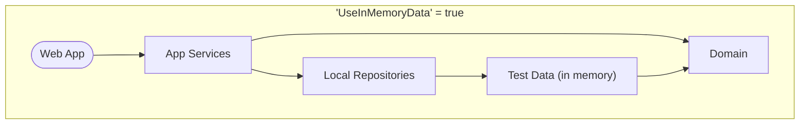
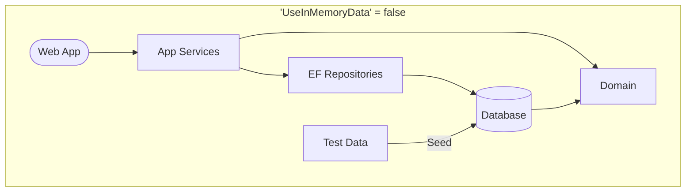
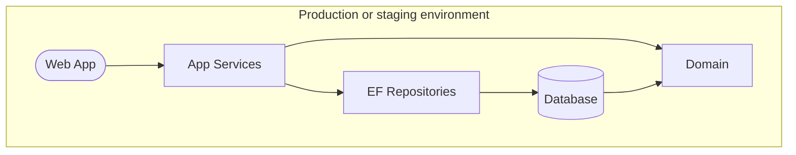

# Template Application

This repository contains a template for use in creating new web applications. See [the instructions](TEMPLATE-HOW-TO.md) for setup and use.

[](https://github.com/gaepdit)
[](https://github.com/gaepdit/template-app/actions/workflows/dotnet-test.yml)
[](https://sonarcloud.io/summary/new_code?id=gaepdit_template-app)
[](https://sonarcloud.io/summary/new_code?id=gaepdit_template-app)

*[The SonarCloud badges require a SonarCloud project to be configured.]*

## Background and project requirements

*Add background and project requirements.*

---

## Info for developers

This is an ASP.NET web application.

### Project ownership

*Add project ownership details.*

### Prerequisites for development

+ [Visual Studio](https://www.visualstudio.com/vs/) or similar
+ [.NET SDK](https://dotnet.microsoft.com/download)

### Preparing for deployment

Complete the following tasks when the application is ready for deployment.

* Create server-specific settings and config files and add copies to the "app-config" GitHub repository.
* Create Web Deploy Publish Profiles for each web server using the "Example-Server.pubxml" file as an example.
* Configure the following external services as needed:
    - [Azure App registration](https://portal.azure.com/#view/Microsoft_AAD_RegisteredApps/ApplicationsListBlade) to manage employee authentication. *(Add configuration settings in the "AzureAd" section in a server settings file.)*
      When configuring the app in the Azure Portal, add optional claims for "email", "family_name", and "given_name" under "Token configuration".
    - [Raygun](https://app.raygun.com/) for crash reporting and performance monitoring. *(Add the API key to the "RaygunSettings" section in a server settings file.)*
    - [SonarCloud](https://sonarcloud.io/projects) for code quality and security scanning. *(Update the project key in the "sonarcloud-scan.yml" workflow file and in the badges above.)*
    - [Better Uptime](https://betterstack.com/better-uptime) for site uptime monitoring. *(No app configuration needed.)*

### Project organization

The solution contains the following projects:

* **Domain** — A class library containing the data models, business logic, and repository interfaces.
* **AppServices** — A class library containing the services used by an application to interact with the domain.
* **LocalRepository** — A class library implementing the repositories and data stores using static in-memory test data (for local development).
* **EfRepository** — A class library implementing the repositories and data stores using Entity Framework and a database (as specified by the configured connection strings).
* **WebApp** — The front end web application and/or API.

There are also corresponding unit test projects for each, plus a **TestData** project containing test data for development and testing.

### Development settings

The following settings configure the data stores and authentication for development purposes. To change these settings, add an "appsettings.Development.json" file in the root of the "WebApp" folder with a `DevSettings` section and a top-level setting named `UseDevSettings`. Here's a sample "appsettings.Development.json" file to start out:

```json
{
  "DevSettings": {
    "UseDevSettings": true,
    "UseInMemoryData": true,
    "UseEfMigrations": false,
    "DeleteAndRebuildDatabase": true,
    "UseAzureAd": false,
    "LocalUserIsAuthenticated": true,
    "LocalUserIsStaff": true,
    "LocalUserIsAdmin": true,
    "UseSecurityHeadersInDev": false
  }
}
```

- *UseDevSettings* — Indicates whether the following Dev settings should be applied.
- *UseInMemoryData*
    - When `true`, the "LocalRepository" project is used for repositories and data stores. Data is initially seeded from the "TestData" project. 
    - When `false`, the "EfRepository" project is used, and a SQL Server database (as specified by the connection string) is created. <small>(If the connection string is missing, then a temporary EF Core in-memory database provider is used. This option is included for convenience and is not recommended.)</small>
- *UseEfMigrations* — Uses Entity Framework database migrations when `true`. When `false`, the `DeleteAndRebuildDatabase` setting controls how the database is handled. (Only applies if *UseInMemoryData* is `false`.)
- *DeleteAndRebuildDatabase* — When set to `true`, the database is deleted and recreated on each run. When set to `false`, the database is not modified on each run. (Only applies if `UseInMemoryData` and `UseEfMigrations` are both `false`.) If the database does not exist yet, it will not be created if this is set to `false`. The database is seeded with data from the "TestData" project only when `UseEfMigrations` is `false` and `DeleteAndRebuildDatabase` is `true`. Otherwise, the data in the database is not changed.
- *UseAzureAd* — If `true`, connects to Azure AD for user authentication. (The app must be registered in the Azure portal, and configuration added to the settings file.) If `false`, authentication is simulated using test user data.
- *LocalUserIsAuthenticated* — Simulates a successful login with a test account when `true`. Simulates a failed login when `false`. (Only applies if *UseAzureAd* is `false`.)
- *LocalUserIsStaff* — Adds the Staff and Site Maintenance Roles to the logged in account when `true` or no roles when `false`. (Applies whether *UserAzureAd* is `true` or `false`.)
- *LocalUserIsAdmin* — Adds all App Roles to the logged in account when `true` or no roles when `false`. (Applies whether *UserAzureAd* is `true` or `false`.)     <small>An alternative way to create admin users is to add them to the `SeedAdminUsers` setting as an array of email addresses.</small>
- *UseSecurityHeadersLocally* — Sets whether to include HTTP security headers when running locally in the Development environment.

#### Production defaults

When `UseDevSettings` is missing or set to `false` or if the `DevSettings` section is missing, the settings are automatically set to production defaults as follows:

```csharp
UseInMemoryData = false,
UseEfMigrations = true,
UseAzureAd = true,
LocalUserIsAuthenticated = false,
LocalUserIsStaff = false,
LocalUserIsAdmin = false,
UseSecurityHeadersInDev: false
```

Here's a visualization of how the settings configure data storage at runtime.






